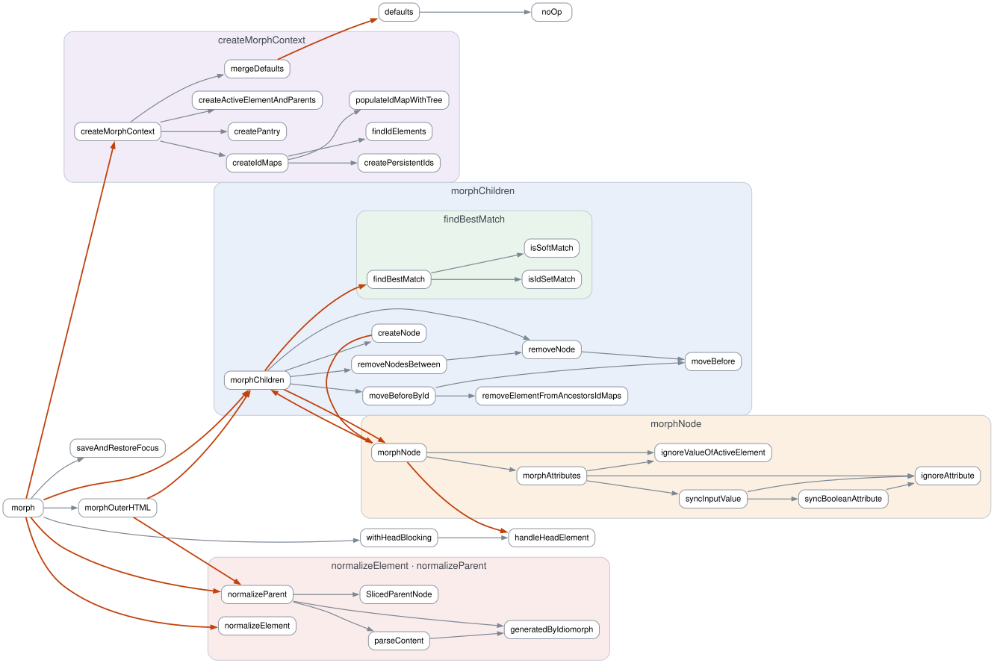

# Idiomorph Architecture

Idiomorph ships as a single script with no build-time module system, so its internal
structure is expressed with closures: one top-level closure holds the library, and each
major concern is a nested IIFE that returns only the handful of names its callers need.
Everything else stays private to that closure.

The point of the arrangement is coupling. A function can only reach what its own closure
declares, plus whatever the closures above it chose to export, so moving a function into a
closure is how we say "nothing outside here needs this". The diagram below is generated
from the source so that claim stays honest.

## The dependency graph

Every declaration in `src/idiomorph.js` is a node, and an arrow means the source
references the target. Boxes are closures, nested exactly as they nest in the file, and
nodes drawn outside every box live in the top-level `Idiomorph` closure.

Grey arrows stay inside one closure. **Orange arrows cross a closure boundary**, and
those are the ones to look at. Each is a name a closure had to expose, or a reach
upward into an outer scope, and each is a place where the modularity is doing less work
than it looks like it is.



Two things the graph is expected to show. `morphChildren` and `morphNode` point at each
other: that mutual recursion is the tree walk itself, and it is why they are siblings
rather than one nested inside the other. And `morphNode` reaches up to `handleHeadElement`
in the top-level closure, which is the `<head>` merge cutting across the ordinary
node-by-node descent.

## Regenerating

```
npm run architecture
```

This overwrites `img/architecture.svg`; nothing edits this document. It also runs as part
of `npm run dist`, so a released build never ships a stale picture. The generator lives in
`scripts/architecture.js`: it reads the source with the TypeScript parser that
`npm run typecheck` already depends on, and lays the graph out with Graphviz compiled to
wasm, so neither step needs anything installed on the machine.
